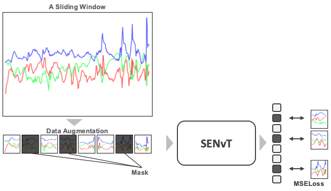

# SENvT

## Changelog
- v1.0 (beta)
   - MSE損失を用いたマルチタスク訓練によるSENvTの初期実装
- v1.1
   - MSE損失に加えて、量子化を使用したクロスエントロピー損失を追加
   - モデルのエンコーダを少し修正

## Installation
```bash
conda create -n <env name> python==3.12
conda activate <env name>
pip install -r req.txt
```

## Pre-training
```bash
python pretrain.py --data-path=<dataset path>
```

<details>
<summary>Data</summary>

ここで想定しているデータのパスは，`train`，`test`ディレクトリの親の階層を指定してください．
```
- dir
  |- data       <----- here
     |- train
        |- 1.npy
        |- 2.npy
        ...
     |- test
        |- a.npy
        ...
```
なお，`*.npy`ファイルは`(N, 3, 300)`という形を想定しています．\
加速度センサから取得できるx,y,zの`3`軸分のデータが，`300`サンプル連続したものを1つのスライディングウィンドウとして，`N`個あることを意味します．\
下流タスクで使用するデータが`(*, 3, 300)`で調整されているので，この形にすることを推奨しますが，独自に変更したい場合は以下のように変更することができます．(ex. `(N, 6, 500)`)
```bash
python pretrain.py --window-size=500 --num-channels=6
```
</details>

<details>
<summary>Training Objectives</summary>

<br>
- 訓練目的は，データ拡張により変化を加えたデータと元データとの"誤差"を最小化すること．
- `--augment-chunk-size`でデータ拡張を適応するチャンクを設定可能．デフォルトでは`50`．ウィンドウサイズが`300`とすると`6`つに分割され各々がランダムに変換されるもしくは何もしない．
- 図の例ではmaskだけが適応されているが，他にもデータ拡張手法を追加できる．
- `--mask`, `--permute`, `--timewarp`, `--rotation`, `--wdba`, `--rgw`, `--dgw`をそれぞれ`True`に設定することでそのタスクが有効化される．
- しかし、`--wdba`, `--rgw`, `--dgw`は同じアクティビティ内でのばらつきを近しいものに変換するような処理のため，ラベルを必要とする．前半4つに関する組み合わせを試すことを推奨．
- 独自の拡張などを加えたい場合は，[`multitask.py`](./sslearning/multitask.py)内の`SignalAugmentation`を改修する．
</details>

<details>
<summary>Task</summary>

- *Mask*\
attention層で他のtokenから参照できないように設定

- *Permutation*\
時間軸に対して，ランダムなチャンクに分割しその順番を入れ替える

- *Time warping*\
時間軸に対して，ランダムに伸縮する

- *Rotation*\
チャンネル軸(x,y,z軸)に対して，ランダム入れ替え．センサーを空間的に回転するイメージ\
なお、このタスクに関しては，MSE損失ではなく，x,y,zをラベルとしたクロスエントロピー損失で"誤差"を測る．

</details>

## Downstream adaption for Human Activity Recognition
```bash
python downstream.py \
    --ckpt=<pre-trained model path> \
    --data-path=<downstream dataset path> \
    --dataset=pamap \
```
